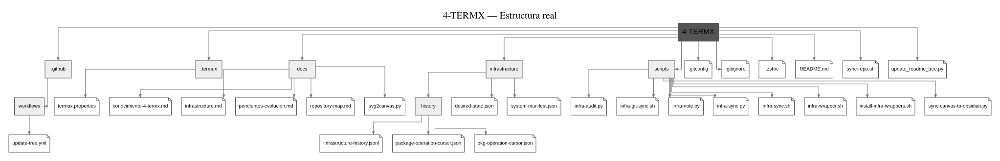
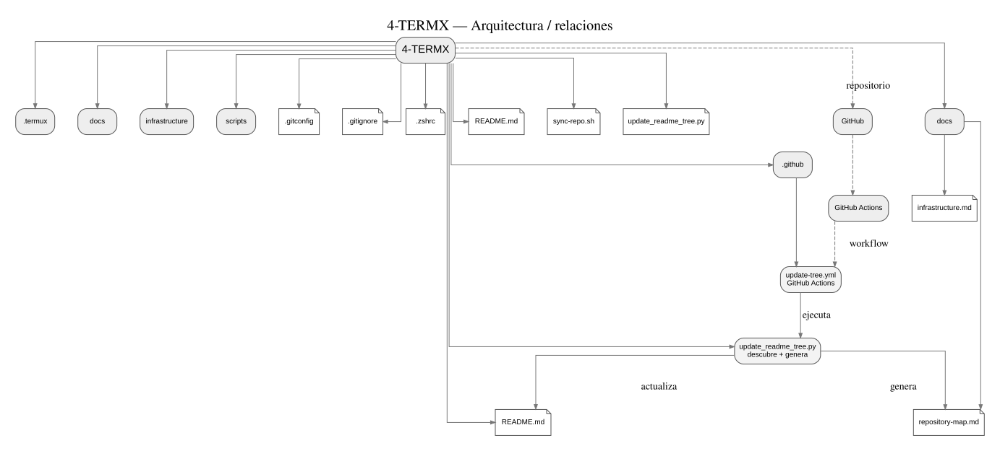

# 📱 4-TERMX — Entorno de Desarrollo Móvil

  
  
  

> Repositorio personal de configuración, flujos de trabajo y experimentación en **Termux** para transformar un dispositivo Android en una estación de trabajo portátil eficiente.

---

## 🚀 Características del Entorno
* **Shell Optimizado:** Configurado con **Zsh** y autocompletado inteligente (`zsh-autosuggestions`).
* **Historial Persistente:** Gestión avanzada de comandos y persistencia extendida.
* **Control de Versiones:** Sincronización segura mediante claves SSH con GitHub.
* **Automatización:** Actualización en tiempo real del árbol de archivos mediante GitHub Actions.

---

## 🏗️ Infrastructure as Data

El entorno Termux se audita mediante un manifiesto estructurado y un historial de reconciliación:

- `infrastructure/system-manifest.json` — estado observado.
- `infrastructure/desired-state.json` — estado deseado.
- `infrastructure/history/infrastructure-history.jsonl` — cambios detectados.
- `scripts/infra-sync.py` — motor de auditoría.

El sistema detecta instalaciones, eliminaciones y cambios de versión aunque el cambio haya sido realizado manualmente. Cuando no existe información sobre el motivo, registra `actor: unknown` y `reason: null`; no inventa contexto.

La reconciliación se ejecuta automáticamente al iniciar Zsh.

## 🗺️ Repository Maps

El repositorio se representa automáticamente de **dos formas complementarias**:

### 1. 🌳 Estructura del repositorio

Muestra la jerarquía real: **directorios como ramas y archivos como hojas**.

[📄 Ver fuente DOT](./docs/repository-structure.dot)

### 2. 🧠 Arquitectura y relaciones

Muestra las relaciones funcionales principales: **GitHub → GitHub Actions → workflow → generador → README/docs**.

[📄 Ver fuente DOT](./docs/repository-architecture.dot)

### 🔄 Actualización automática

~~~text
Nuevo archivo/directorio
        │
        ▼
     git push
        │
        ▼
 GitHub Actions
        │
        ├── descubre la estructura actual
        ├── genera el grafo estructural
        ├── genera el grafo de arquitectura
        ├── actualiza README.md
        └── actualiza el File Manifest
        │
        ▼
 Commit automático de documentación
~~~

**Actualización automática:** el workflow se ejecuta en cada push a main y también puede ejecutarse manualmente. Cuando agregues, modifiques o elimines archivos en main, los dos grafos se vuelven a generar a partir del estado real del repositorio.

Graphviz genera los SVG estáticos desde archivos DOT; ambos formatos quedan versionados dentro de docs/.

<!-- FILE-MANIFEST:START -->
## 📦 File Manifest Table

> **Generado automáticamente por GitHub Actions.** Representa los archivos visibles del repositorio; secretos y material SSH están excluidos.

| Estado | Archivo | Tipo | Tamaño | Función |
|---|---|---|---:|---|
| — | [<code>.gitconfig</code>](./.gitconfig) | Configuración | 64 B | Archivo Configuración del proyecto. |
| — | [<code>.github/workflows/update-tree.yml</code>](./.github/workflows/update-tree.yml) | GitHub Actions | 1.5 KB | Workflow de automatización de GitHub Actions. |
| — | [<code>.gitignore</code>](./.gitignore) | Configuración | 398 B | Archivo Configuración del proyecto. |
| — | [<code>.termux/termux.properties</code>](./.termux/termux.properties) | Archivo | 5.9 KB | Archivo Archivo del proyecto. |
| — | [<code>.zshrc</code>](./.zshrc) | Configuración | 319 B | Archivo Configuración del proyecto. |
| — | [<code>README.md</code>](./README.md) | Markdown | 12.3 KB | Documentación central del entorno Termux. |
| — | [<code>docs/conocimiento-4-termx.md</code>](./docs/conocimiento-4-termx.md) | Markdown | 2.4 KB | Archivo Markdown del proyecto. |
| — | [<code>docs/infrastructure.md</code>](./docs/infrastructure.md) | Markdown | 4.7 KB | Archivo Markdown del proyecto. |
| — | [<code>docs/pendientes-evolucion.md</code>](./docs/pendientes-evolucion.md) | Markdown | 7.5 KB | Archivo Markdown del proyecto. |
| — | [<code>docs/repository-architecture.dot</code>](./docs/repository-architecture.dot) | Archivo | 2.6 KB | Archivo Archivo del proyecto. |
| — | [<code>docs/repository-architecture.svg</code>](./docs/repository-architecture.svg) | Archivo | 20.3 KB | Archivo Archivo del proyecto. |
| — | [<code>docs/repository-map.md</code>](./docs/repository-map.md) | Markdown | 1.1 KB | Archivo Markdown del proyecto. |
| — | [<code>docs/repository-structure.dot</code>](./docs/repository-structure.dot) | Archivo | 4.0 KB | Archivo Archivo del proyecto. |
| — | [<code>docs/repository-structure.svg</code>](./docs/repository-structure.svg) | Archivo | 24.7 KB | Archivo Archivo del proyecto. |
| — | [<code>infrastructure/desired-state.json</code>](./infrastructure/desired-state.json) | JSON | 597 B | Archivo JSON del proyecto. |
| — | [<code>infrastructure/history/infrastructure-history.jsonl</code>](./infrastructure/history/infrastructure-history.jsonl) | Archivo | 2.2 KB | Archivo Archivo del proyecto. |
| — | [<code>infrastructure/history/pkg-operation-cursor.json</code>](./infrastructure/history/pkg-operation-cursor.json) | JSON | 54 B | Archivo JSON del proyecto. |
| — | [<code>infrastructure/system-manifest.json</code>](./infrastructure/system-manifest.json) | JSON | 4.2 KB | Archivo JSON del proyecto. |
| — | [<code>scripts/infra-audit.py</code>](./scripts/infra-audit.py) | Python | 2.2 KB | Archivo Python del proyecto. |
| — | [<code>scripts/infra-git-sync.sh</code>](./scripts/infra-git-sync.sh) | Shell | 398 B | Archivo Shell del proyecto. |
| — | [<code>scripts/infra-note.py</code>](./scripts/infra-note.py) | Python | 1.1 KB | Archivo Python del proyecto. |
| — | [<code>scripts/infra-sync.py</code>](./scripts/infra-sync.py) | Python | 12.7 KB | Archivo Python del proyecto. |
| — | [<code>scripts/infra-sync.sh</code>](./scripts/infra-sync.sh) | Shell | 181 B | Archivo Shell del proyecto. |
| — | [<code>scripts/infra-wrapper.sh</code>](./scripts/infra-wrapper.sh) | Shell | 884 B | Archivo Shell del proyecto. |
| — | [<code>scripts/install-infra-wrappers.sh</code>](./scripts/install-infra-wrappers.sh) | Shell | 840 B | Archivo Shell del proyecto. |
| — | [<code>sync-repo.sh</code>](./sync-repo.sh) | Shell | 1.1 KB | Sincronización del repositorio desde Termux. |
| — | [<code>update_readme_tree.py</code>](./update_readme_tree.py) | Python | 12.8 KB | Generador automático del manifiesto y los dos grafos. |

### 📂 Bloques colapsables por componente

📁 <strong>.github</strong> — 1 archivos / 1.5 KB

- [<code>.github/workflows/update-tree.yml</code>](./.github/workflows/update-tree.yml) — **1.5 KB** — Workflow de automatización de GitHub Actions.

📁 <strong>.termux</strong> — 1 archivos / 5.9 KB

- [<code>.termux/termux.properties</code>](./.termux/termux.properties) — **5.9 KB** — Archivo Archivo del proyecto.

📁 <strong>docs</strong> — 8 archivos / 67.2 KB

- [<code>docs/conocimiento-4-termx.md</code>](./docs/conocimiento-4-termx.md) — **2.4 KB** — Archivo Markdown del proyecto.
- [<code>docs/infrastructure.md</code>](./docs/infrastructure.md) — **4.7 KB** — Archivo Markdown del proyecto.
- [<code>docs/pendientes-evolucion.md</code>](./docs/pendientes-evolucion.md) — **7.5 KB** — Archivo Markdown del proyecto.
- [<code>docs/repository-architecture.dot</code>](./docs/repository-architecture.dot) — **2.6 KB** — Archivo Archivo del proyecto.
- [<code>docs/repository-architecture.svg</code>](./docs/repository-architecture.svg) — **20.3 KB** — Archivo Archivo del proyecto.
- [<code>docs/repository-map.md</code>](./docs/repository-map.md) — **1.1 KB** — Archivo Markdown del proyecto.
- [<code>docs/repository-structure.dot</code>](./docs/repository-structure.dot) — **4.0 KB** — Archivo Archivo del proyecto.
- [<code>docs/repository-structure.svg</code>](./docs/repository-structure.svg) — **24.7 KB** — Archivo Archivo del proyecto.

📁 <strong>infrastructure</strong> — 4 archivos / 7.0 KB

- [<code>infrastructure/desired-state.json</code>](./infrastructure/desired-state.json) — **597 B** — Archivo JSON del proyecto.
- [<code>infrastructure/history/infrastructure-history.jsonl</code>](./infrastructure/history/infrastructure-history.jsonl) — **2.2 KB** — Archivo Archivo del proyecto.
- [<code>infrastructure/history/pkg-operation-cursor.json</code>](./infrastructure/history/pkg-operation-cursor.json) — **54 B** — Archivo JSON del proyecto.
- [<code>infrastructure/system-manifest.json</code>](./infrastructure/system-manifest.json) — **4.2 KB** — Archivo JSON del proyecto.

📁 <strong>raíz</strong> — 6 archivos / 26.9 KB

- [<code>.gitconfig</code>](./.gitconfig) — **64 B** — Archivo Configuración del proyecto.
- [<code>.gitignore</code>](./.gitignore) — **398 B** — Archivo Configuración del proyecto.
- [<code>.zshrc</code>](./.zshrc) — **319 B** — Archivo Configuración del proyecto.
- [<code>README.md</code>](./README.md) — **12.3 KB** — Documentación central del entorno Termux.
- [<code>sync-repo.sh</code>](./sync-repo.sh) — **1.1 KB** — Sincronización del repositorio desde Termux.
- [<code>update_readme_tree.py</code>](./update_readme_tree.py) — **12.8 KB** — Generador automático del manifiesto y los dos grafos.

📁 <strong>scripts</strong> — 7 archivos / 18.3 KB

- [<code>scripts/infra-audit.py</code>](./scripts/infra-audit.py) — **2.2 KB** — Archivo Python del proyecto.
- [<code>scripts/infra-git-sync.sh</code>](./scripts/infra-git-sync.sh) — **398 B** — Archivo Shell del proyecto.
- [<code>scripts/infra-note.py</code>](./scripts/infra-note.py) — **1.1 KB** — Archivo Python del proyecto.
- [<code>scripts/infra-sync.py</code>](./scripts/infra-sync.py) — **12.7 KB** — Archivo Python del proyecto.
- [<code>scripts/infra-sync.sh</code>](./scripts/infra-sync.sh) — **181 B** — Archivo Shell del proyecto.
- [<code>scripts/infra-wrapper.sh</code>](./scripts/infra-wrapper.sh) — **884 B** — Archivo Shell del proyecto.
- [<code>scripts/install-infra-wrappers.sh</code>](./scripts/install-infra-wrappers.sh) — **840 B** — Archivo Shell del proyecto.

**Total actual:** 27 archivos — **126.8 KB**

_Este bloque es mantenido por Actions. No editar manualmente entre los marcadores._
<!-- FILE-MANIFEST:END -->

---

## 📌 Pendientes de evolución

> **Estado del proyecto:** en evolución continua.  
> Esta sección permite identificar rápidamente qué mejoras están pendientes y dónde se encuentra actualmente el proyecto.

### 🔴 Pendiente prioritario

- [ ] **Diseñar la metodología de gestión del ciclo de vida del desarrollo.**
  - Definir el flujo desde necesidad/objetivo hasta desarrollo, pruebas, evidencia, deployment y evolución.
  - Establecer trazabilidad entre objetivos, issues, ramas, decisiones, commits, pruebas y deployments.
  - Diseñar la estructura documental para que una IA pueda consultar y reconstruir el contexto técnico e histórico del proyecto.
  - Detalle completo: [`docs/pendientes-evolucion.md`](./docs/pendientes-evolucion.md)

### 🟡 Mejoras de documentación y arquitectura

- [ ] **Badge de estado de GitHub Actions.**
- [ ] **Quick Start** para explicar el inicio y uso del proyecto.
- [ ] **Arquitectura explícita** y explicación formal de componentes y flujos.
- [ ] **Modelo de evidencia y confianza** para diferenciar observación, inferencia e historial.
- [ ] **Design Principles** del proyecto.
- [ ] Evaluar `SECURITY.md`.
- [ ] Evaluar `CONTRIBUTING.md` si el proyecto comienza a recibir colaboradores.

### 📍 Estado de evolución

Los pendientes anteriores representan **mejoras planificadas**, no necesariamente defectos del sistema actual. El objetivo es que cada evolución futura pueda quedar documentada, validada y trazable.

Para el detalle metodológico y los criterios de evolución, consultar [`docs/pendientes-evolucion.md`](./docs/pendientes-evolucion.md).
