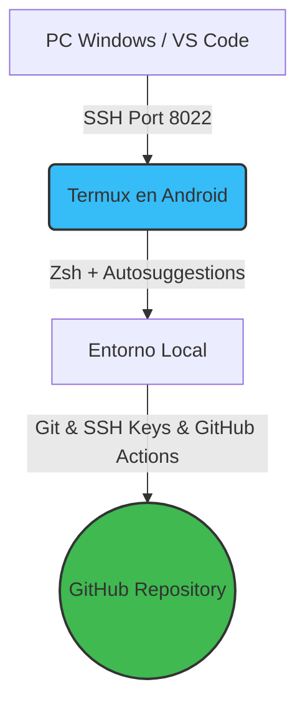

# 📱 4-TERMX — Entorno de Desarrollo Móvil

  
  
  

> Repositorio personal de configuración, flujos de trabajo y experimentación en **Termux** para transformar un dispositivo Android en una estación de trabajo portátil eficiente.

---

## 🚀 Características del Entorno
* **Shell Optimizado:** Configurado con **Zsh** y autocompletado inteligente (`zsh-autosuggestions`).
* **Historial Persistente:** Gestión avanzada de comandos y persistencia extendida.
* **Control de Versiones:** Sincronización segura mediante claves SSH con GitHub.
* **Automatización:** Actualización en tiempo real del árbol de archivos mediante GitHub Actions.

---

## 📊 Arquitectura del Flujo de Trabajo

<!-- FILE-MANIFEST:START -->
## 📦 File Manifest Table

> **Generado automáticamente por GitHub Actions.** Representa los archivos visibles del repositorio; secretos y material SSH están excluidos.

| Estado | Archivo | Tipo | Tamaño | Función |
|---|---|---|---:|---|
| — | [<code>.gitconfig</code>](./.gitconfig) | Configuración | 64 B | Archivo Configuración del proyecto. |
| — | [<code>.github/workflows/update-tree.yml</code>](./.github/workflows/update-tree.yml) | GitHub Actions | 1.1 KB | Workflow de automatización de GitHub Actions. |
| — | [<code>.gitignore</code>](./.gitignore) | Configuración | 179 B | Archivo Configuración del proyecto. |
| — | [<code>.termux/termux.properties</code>](./.termux/termux.properties) | Archivo | 5.9 KB | Archivo Archivo del proyecto. |
| — | [<code>.zshrc</code>](./.zshrc) | Configuración | 84 B | Archivo Configuración del proyecto. |
| — | [<code>README.md</code>](./README.md) | Markdown | 5.3 KB | Documentación central del entorno Termux. |
| — | [<code>sync-repo.sh</code>](./sync-repo.sh) | Shell | 1.1 KB | Sincronización del repositorio desde Termux. |
| — | [<code>update_readme_tree.py</code>](./update_readme_tree.py) | Python | 7.5 KB | Generador automático del manifiesto y Repository Map. |

### 📂 Bloques colapsables por componente

📁 <strong>.github</strong> — 1 archivos / 1.1 KB

- [<code>.github/workflows/update-tree.yml</code>](./.github/workflows/update-tree.yml) — **1.1 KB** — Workflow de automatización de GitHub Actions.

📁 <strong>.termux</strong> — 1 archivos / 5.9 KB

- [<code>.termux/termux.properties</code>](./.termux/termux.properties) — **5.9 KB** — Archivo Archivo del proyecto.

📁 <strong>raíz</strong> — 6 archivos / 14.2 KB

- [<code>.gitconfig</code>](./.gitconfig) — **64 B** — Archivo Configuración del proyecto.
- [<code>.gitignore</code>](./.gitignore) — **179 B** — Archivo Configuración del proyecto.
- [<code>.zshrc</code>](./.zshrc) — **84 B** — Archivo Configuración del proyecto.
- [<code>README.md</code>](./README.md) — **5.3 KB** — Documentación central del entorno Termux.
- [<code>sync-repo.sh</code>](./sync-repo.sh) — **1.1 KB** — Sincronización del repositorio desde Termux.
- [<code>update_readme_tree.py</code>](./update_readme_tree.py) — **7.5 KB** — Generador automático del manifiesto y Repository Map.

**Total actual:** 8 archivos — **21.2 KB**

_Este bloque es mantenido por Actions. No editar manualmente entre los marcadores._
<!-- FILE-MANIFEST:END -->
